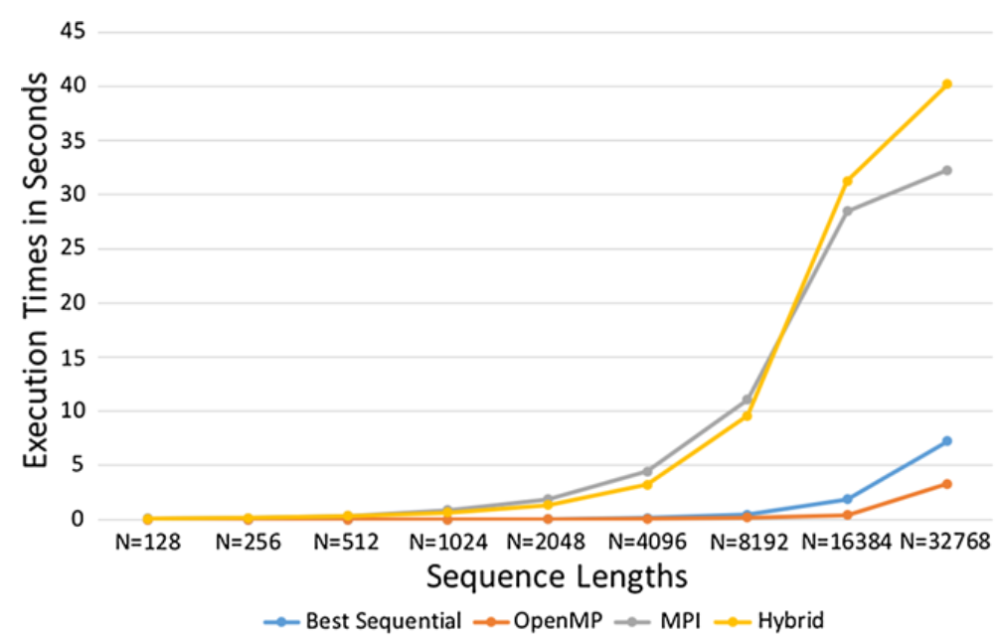
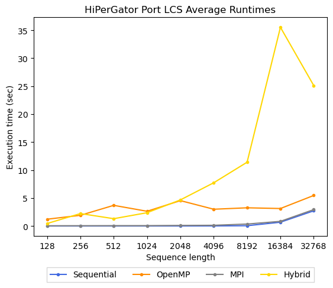

# Analyzing LCS for DNA Sequencing using Parallel Programming Techniques

The goal of this project is to port multiple implementations for a parallelized LCS aglorithm to the HiPerGator computing platform to reproduce results, profile the program, and experiment with code modifications to improve performance specifically for the HiPerGator computing platform.

# 1. HiPerGator Port

Porting the application required no code modification as the applications used compatible versions of MPI and OpenMP available on the HiPerGator computing platform. Regarding resource configuration, separate job scripts were created according to the original mapping of resources outlined in the existing repository with respect to the class resource constraints.

## Benchmark Results

We used the same simulated data files for the experimental trials of varying sequence lengths. Without modification of the resource configuration, we ran the applications 4 times and averaged the results. For all experiments, we used the space optimized version 2 of the algorithm, which does not include branching.

To replicate the results and port to HiPerGator, we compiled the source code for MPI and OpenMP respectively using the available tools on the HiPerGator platform, and then translated the available SLURM scripts to SLURM scripts compatible with the HiPerGator resource constraints.

### Sequential

Data File | Sequence Length | Execution Times (sec) | Average Time (sec) |
-- | -- | -- | -- |
1 | 128    | 0.000371 0.000023 0.000371 0.000020 0.000017 0.000015 0.000016 0.000018 0.000017 0.000015 | 0.0001
2 | 256    | 0.000441 0.000049 0.000049 0.000049 0.000046 0.000064 0.000062 0.000048 0.000050 0.000064 | 0.0001
3 | 512    | 0.000207 0.000207 0.000203 0.000198 0.000201 0.000206 0.000204 0.000205 0.000199 0.000201 | 0.0002
4 | 1024   | 0.000779 0.000853 0.001245 0.000796 0.000869 0.000905 0.000810 0.000938 0.000801 0.000814 | 0.0009
5 | 2048   | 0.002980 0.002948 0.003000 0.002997 0.003033 0.002953 0.003064 0.003038 0.002962 0.002958 | 0.0030
6 | 4096   | 0.012194 0.011941 0.011916 0.012104 0.011995 0.011965 0.012476 0.012556 0.012582 0.011893 | 0.0122
7 | 8192   | 0.049810 0.049226 0.049130 0.045651 0.049054 0.049443 0.048955 0.049533 0.048858 0.046275 | 0.0486
8 | 16384  | 0.231989 0.233137 0.786195 0.789942 0.782391 0.776745 0.784816 0.778986 0.786684 0.788419 | 0.6739
9 | 32768  | 2.606464 2.605415 2.609088 2.604304 2.797391 2.868034 2.777950 2.811413 2.661989 2.796924 | 2.7139

### MPI

This resource configuration used 4 MPI ranks, with 1 node per rank.

Data File | Sequence Length | Execution Times (sec) | Average Time (sec) |
-- | -- | -- | -- |
1 | 128    | 0.019729 0.022177 0.03823 0.056542 0.048627 0.032777 0.053743 0.044773 0.028842 0.046976 | 0.0392
2 | 256    | 0.026766 0.06133 0.072586 0.059328 0.026465 0.038507 0.062153 0.043889 0.030711 0.06052 | 0.0482
3 | 512    | 0.063678 0.035605 0.058359 0.080986 0.093693 0.045625 0.053005 0.055674 0.033691 0.050643 | 0.0571
4 | 1024   | 0.045182 0.053157 0.074414 0.082618 0.059639 0.061575 0.06521 0.059162 0.06607 0.056574  | 0.0624
5 | 2048   | 0.10042 0.109785 0.156331 0.092311 0.081484 0.090192 0.077452 0.121056 0.091945 0.072413 | 0.0993
6 | 4096   | 0.115745 0.137244 0.122812 0.114469 0.127335 0.134278 0.137722 0.141049 0.115973 0.113538 | 0.126
7 | 8192   | 0.263248 0.371826 0.295419 0.322134 0.325134 0.315329 0.344122 0.41915 0.438704 0.366474 | 0.3462
8 | 16384  | 1.033553 0.697195 0.626562 0.800125 1.0532 0.875816 0.836243 0.714566 0.778922 0.871328  | 0.8288
9 | 32768  | 2.878253 2.999817 2.994717 3.254026 3.261782 3.206938 3.324159 3.245434 2.06097 2.098348 | 2.9324

### OpenMP

This resource configuration used 16 HW threads, with 1 SW thread (OMP thread) per HW thread.

Data File | Sequence Length | Execution Times (sec) | Average Time (sec) |
-- | -- | -- | -- |
1 | 128    | 1.365148 1.733693 0.524365 1.392096 1.455715 1.361408 0.125524 1.514258 1.253844 1.376699 | 1.2103
2 | 256    | 2.750452 2.291662 1.85998 0.294436 2.749336 1.773968 2.716889 1.015483 0.908677 2.737538 | 1.9098
3 | 512    | 2.537857 2.109428 5.460088 0.956158 2.448417 0.751005 5.543553 5.649377 6.033497 5.400465 | 3.689
4 | 1024   | 0.094235 0.070896 0.042511 0.032957 0.031723 0.413642 5.214807 2.950355 5.294654 12.166126 | 2.6312
5 | 2048   | 1.155797 3.123122 2.056894 0.603369 1.065944 11.809286 2.302476 13.890807 8.992258 0.334972 | 4.5335
6 | 4096   | 1.460431 4.015968 0.349657 1.887938 14.856938 2.73253 0.050808 1.668156 1.53982 1.37705 | 2.9939
7 | 8192   | 2.902658 1.458237 4.955549 0.697717 0.93535 7.98361 7.214968 0.653267 1.848592 3.852805 | 3.2503
8 | 16384  | 0.619363 1.797766 3.570588 3.200398 1.516538 0.412951 2.783114 2.611429 13.890023 0.820922 | 3.1223
9 | 32768  | 2.283845 8.130311 1.241325 9.216436 1.324067 3.544851 10.520482 1.168947 15.430236 1.728614 | 5.4589

### OpenMP+MPI

This resource configuration used 4 MPI ranks, with 1 node per rank, along with 8 HW threads with 2 SW threads (OMP threads) per HW thread. Therefore, there was a total of 16 threads per MPI rank. We tried to push as much as the threading to the HW level as possible.

Expected Output: _lcs_parallel/Experimental Codes/hybrid/row_wise_v2/output.txt_
```
chunk_p: 1 chunk_dp: 8192 procs: 4
lcs_yang_v2 is: 9793
time taken for lcs_yang_v2 is: 84.181711
```
Received Output:
```
Your input file: /home/c.ruskin/eel6763/project/data/9.txt 
chunk_p: 1 chunk_dp: 8192 procs: 4
lcs_yang_v2 is: 9793
time taken for lcs_yang_v2 is: 18.410843
```

Data File | Sequence Length | Execution Times (sec) | Average Time (sec)
-- | -- | -- | -- |
1 | 128    | 1.160284 1.531648 0.266275 0.548088 0.239805 0.072323 0.081891 0.069805 0.190384 0.218161 | 0.4379
2 | 256    | 0.197626 0.279324 4.668157 0.387672 6.462353 1.484835 2.844701 2.042940 0.765231 3.072877 | 2.2206
3 | 512    | 0.985455 0.188529 0.471908 6.271154 0.614593 0.178996 0.180045 0.476519 3.201555 0.483542 | 1.3052
4 | 1024   | 4.340137 0.450255 2.220740 0.643680 0.143427 6.914408 0.092973 0.107141 0.356598 8.466495 | 2.3736
5 | 2048   | 9.384179 0.374571 25.842704 0.329829 1.708575 0.129476 0.255980 0.462912 6.919479 1.233732 | 4.6641
6 | 4096   | 0.270917 31.765062 0.432005 0.249861 0.299286 0.377718 7.341979 11.498047 24.888295 0.156566 | 7.728
7 | 8192   | 5.060595 1.489765 19.549317 4.812395 15.354794 22.566437 7.644825 2.059040 25.541811 9.915244 | 11.3994
8 | 16384  | 65.547007 7.618724 6.521599 9.759822 40.410821 29.455607 74.468613 66.034749 36.462286 18.877345 | 35.5157
9 | 32768  | 5.878036 49.894558 21.904620 5.441529 7.181469 7.785590 16.857561 40.137565 23.011245 72.876006 | 25.0968

# 2. Comparison with Published Results

The following table approximates the recorded measurements referenced in the paper's graph (Figure 2 (a)).



Data File | Sequence Length | Sequential (sec) | MPI (sec) | OpenMP (sec) | OpenMP+MPI (sec)
-- | -- | -- | -- | -- | -- |
1 | 128    | ~0 | ~0 | ~0 | ~0
2 | 256    | ~0 | ~0 | ~0 | ~0
3 | 512    | ~0 | ~0 | ~0 | ~0
4 | 1024   | ~0 | 1 | ~0 | 1
5 | 2048   | ~0 | 2.5 | ~0 | 2
6 | 4096   | ~0 | 5 | ~0 | 4
7 | 8192   | 0.5 | 11 | ~0 | 10
8 | 16384  | 2 | 28 | 0.5 | 32
9 | 32768  | 7 | 33 | 4 | 40

The graphical results of our experimental porting of the application to the HiPerGator are provided below.



# References

[1] https://www.ncbi.nlm.nih.gov/pmc/articles/PMC6458724/  
[2] https://github.com/RayhanShikder/lcs_parallel/tree/master